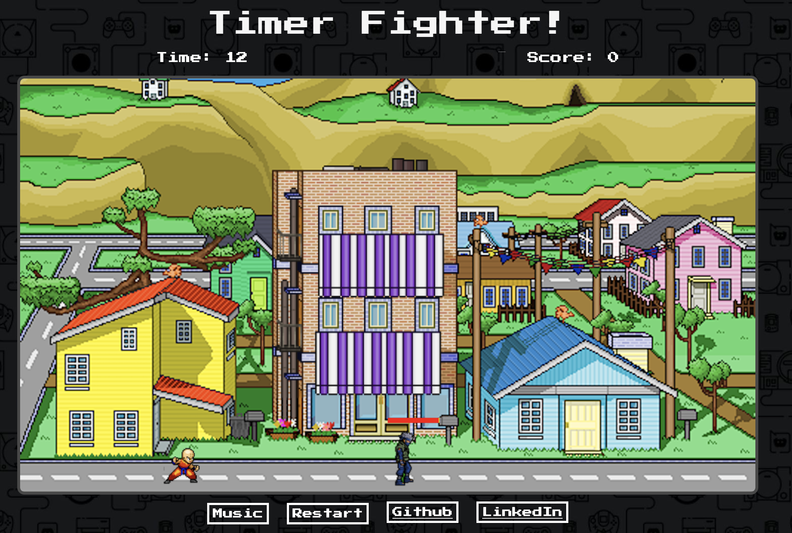
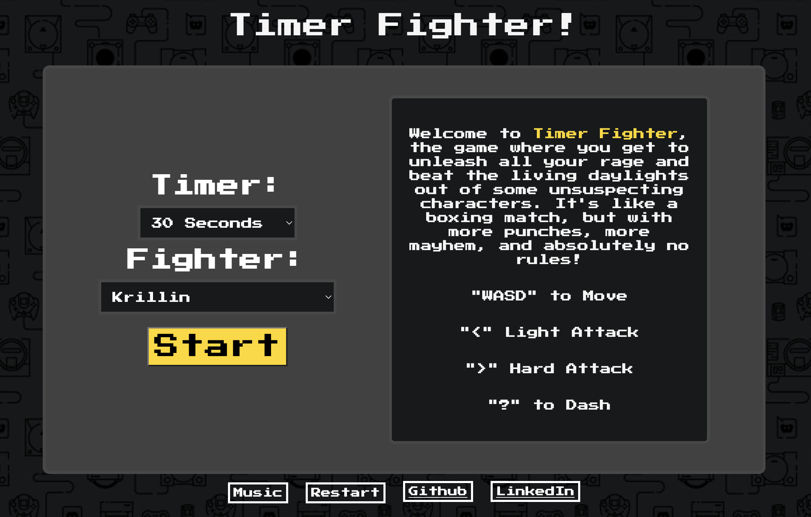
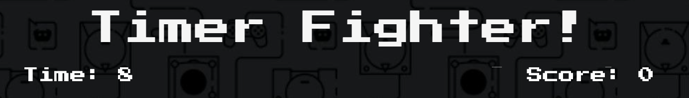
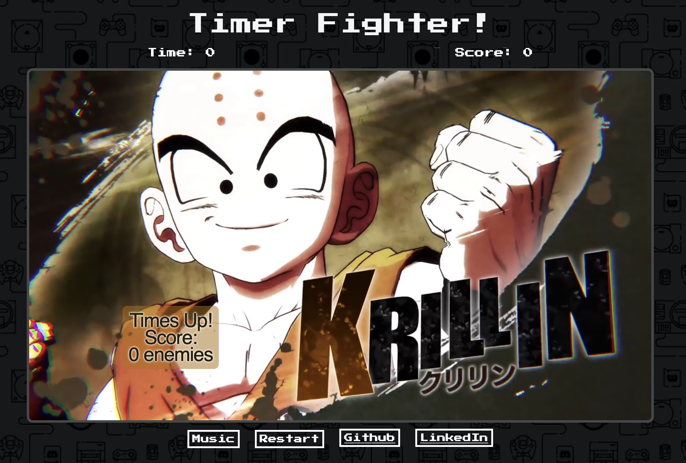
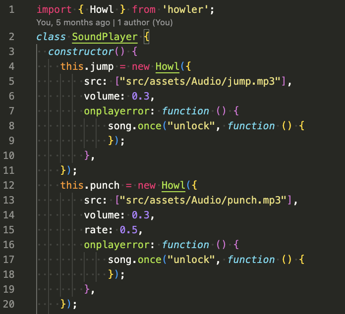

# Timer Fighter
Live Site: [Timer Fighter](vstoic.github.io/TimerFighter/)

## Background and Overview:
TimerFighter is an arcade fighting game where you take on bots in a race against the clock. With each victory, the bots get tougher, so you'll need to master an arsenal of moves to become the ultimate bot-beater. Can you smash the timer and claim victory?
 

## Functionality & MVPs:

### Menu Screen
- Players select a character, and timer
- Instructions & a detailed character combo list
 

### Timer & Score Display
- A count down clock that stops the game
 

- End game screen with Score 
 

### Fighter
- Has many unique characters, each with their own attack combinations
- Each character has unite animations

### Battleground (Canvas)
- Background has animation

### Music & sound (Howler.js)
- Play and pause music
- Sound Effects

## Technologies Used
- Javascript
- SASS
- Webpack
- Canvas
- Howler.js

