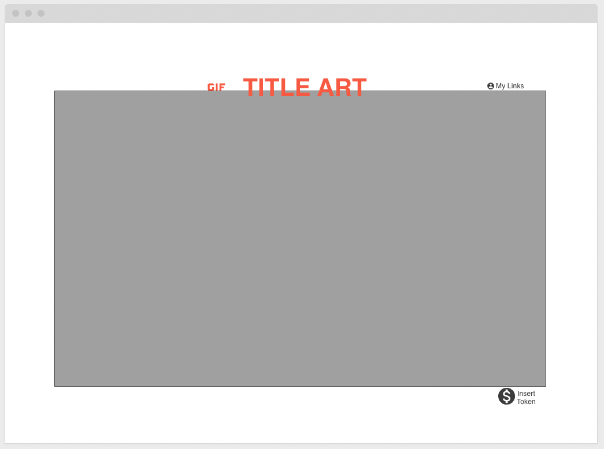
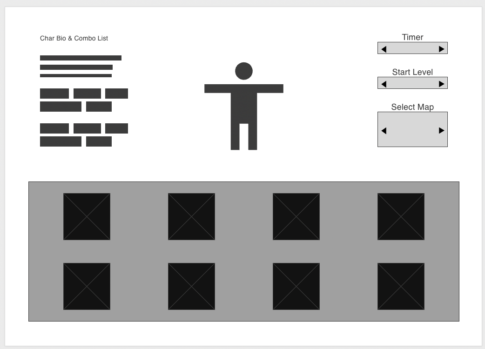
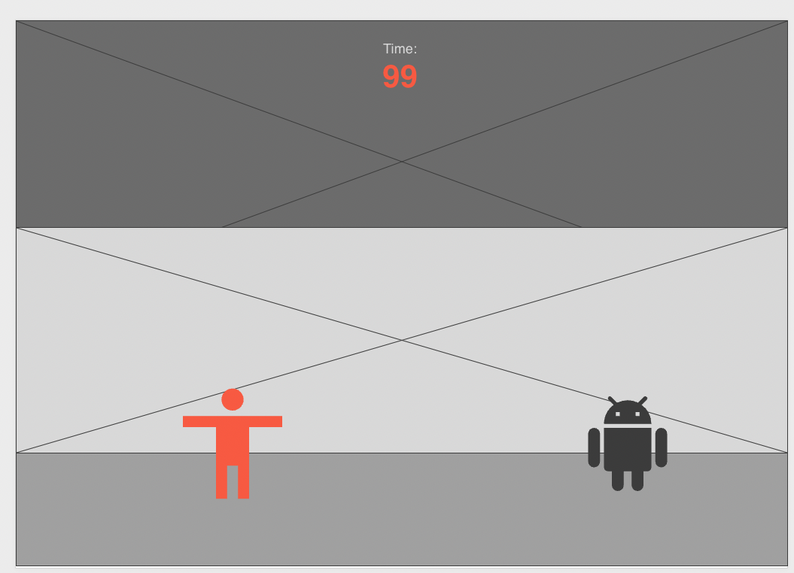

Background:

TimerFighter is a arcade fighting game where you have to defeat as many bots
within an selected time. The bots will only defend againtst player and the defence level of bot will increase with each victory.
Each characters have different styles of play and sets of moves. It will be up to the player to become proficient and smash the timer.

Functionality & MVPs:

Core features or functionalities
-Has many unique characters, each with their own attack combinations
-Players select a character, map, timer and game dificulty
-There will always be one bot to fight
-Bots will improve blocking intuition for every other spawn
-A detailed character combo list 
-Music & sound 

Other Aspects:
{ A lobby animation screen } 
{ Character select screen with character combonation tables } 
{ Music selection with queue } 
{ Production Readme } 

Wireframes:

 

 

 
Implementation Timeline:
Friday Afternoon - project setup 
Weekend - create player and bots, move characters with event listeners 
Monday - attacks & combos, gametimer,   
Tuesday - game menu 
Wednesday - sprite implementation 
Thursday Morning - sprite implementation 

